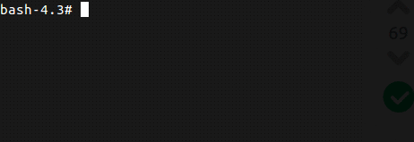

This is a Dockerfile/image extends [richarvey/nginx-php-fpm](https://github.com/richarvey/nginx-php-fpm).
## Usage
After login to docker container there is a command debug which enable/disable xdebug and restart php-fpm service. 
```bash
debug [on|off]
```


## Sample docker-compose configuration for this image
```yaml
version: "3.1"
services:
    db:
      image: mariadb:10.1
      environment:
        - MYSQL_ROOT_PASSWORD=pass
        - MYSQL_DATABASE=db
        - MYSQL_USER=db
        - MYSQL_PASSWORD=db
      volumes:
      # synchornize db files
          - ./docker/tmp/db/mysql:/var/lib/mysql
      ports:
      # set private ip (for multiple docker container)
        - 127.0.0.10:3306:3306
    php:
        container_name: php
        image: dzordz/xdebug-nginx-php
        ports:
            - 127.0.0.10:80:80
        working_dir: /var/www/app
        environment:
        # xdebug cli config
            - XDEBUG_CONFIG=remote_host=${REMOTE_HOST-192.168.2.127} idekey=PHPSTORM
            - PHP_IDE_CONFIG=serverName=docker.loc
        volumes:
            # sync main directory
            - ./:/var/www/app
            # sync other vhost
            - ./docker/vhost/default.conf:/etc/nginx/sites-available/default.conf
            # add ext php confi
            - ./docker/php/php.ini:/usr/local/etc/php/conf.d/php_extra.ini
            # sync bash_history
            - ./docker/tmp/.bash_history:/root/.bash_history
```

To find your REMOTE_HOST you can use command: ``/sbin/ip route|awk '/default/ { print $3 }'`` inside docker container. More information avaible [here](https://gist.github.com/chadrien/c90927ec2d160ffea9c4).
### Sample directory structure

```
project
│   docker-compose.yml
└───docker
    └───php
    |   │   php.ini
    └───vhost
    |   │   vhost.ini
    └───tmp
        │   .bash_history
        │   ...
```